# NammaKrushi MCP Agents Architecture

This document provides detailed architecture diagrams and explanations for each agent in the NammaKrushi Model Context Protocol (MCP) system based on the actual implementation.

## 🏗️ Overall MCP System Architecture

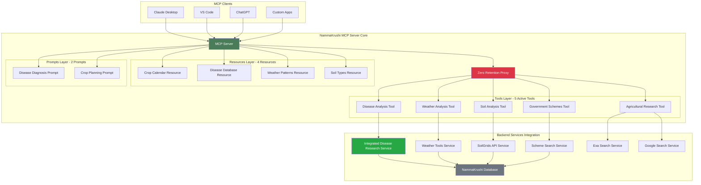

## 🔬 Disease Analysis Agent

The Disease Analysis Agent provides AI-powered crop disease diagnosis from symptoms and images.

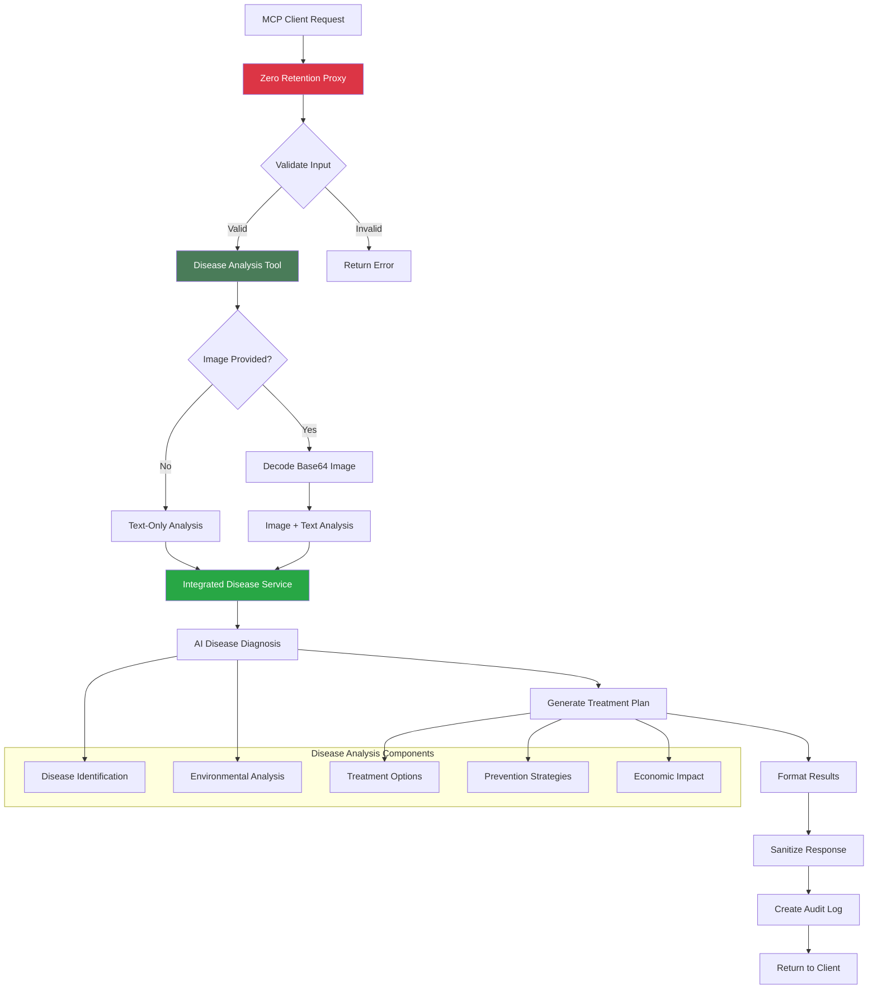

### Disease Analysis Flow Details:

1. **Input Processing**: Receives crop type, symptoms, location, and optional image
2. **Data Sanitization**: Removes PII and sanitizes location to city level
3. **Image Handling**: Decodes base64 images for visual analysis
4. **AI Analysis**: Uses integrated disease research service for diagnosis
5. **Result Formatting**: Structures response with diagnosis, treatments, and recommendations
6. **Privacy Protection**: Filters sensitive data before returning results

## 🌤️ Weather Analysis Agent

The Weather Analysis Agent provides agricultural weather forecasts and farming recommendations.

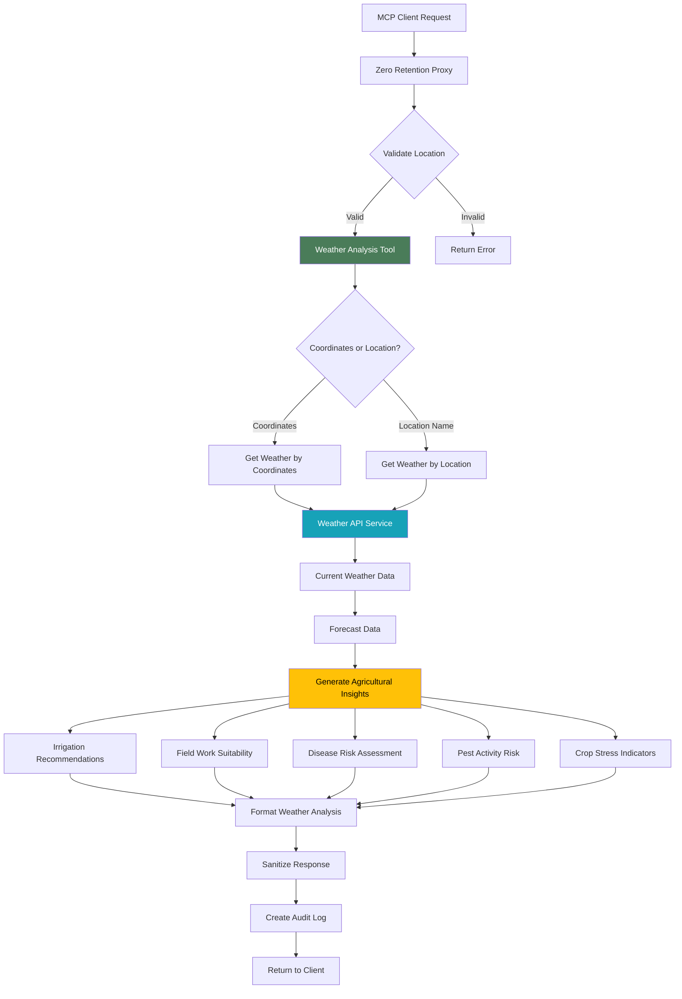

### Weather Analysis Components:

1. **Location Processing**: Handles both coordinates and location names
2. **Weather Data Retrieval**: Fetches current conditions and forecasts
3. **Agricultural Assessment**: Analyzes weather impact on farming activities
4. **Risk Evaluation**: Assesses disease, pest, and crop stress risks
5. **Recommendations**: Provides actionable farming guidance based on weather

## 🌱 Soil Analysis Agent

The Soil Analysis Agent analyzes soil properties and provides crop recommendations.

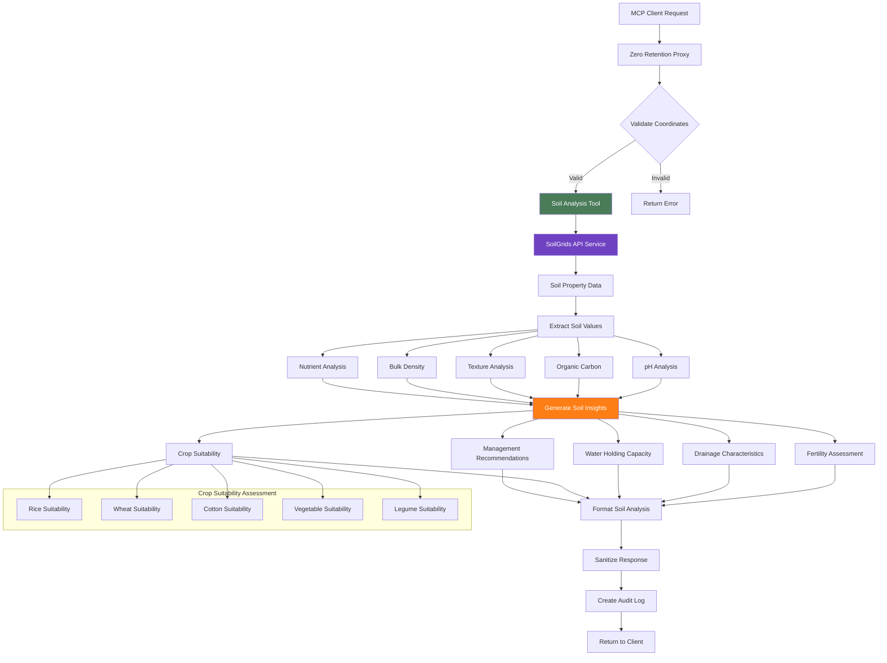

### Soil Analysis Features:

1. **Coordinate Validation**: Ensures valid latitude/longitude ranges
2. **SoilGrids Integration**: Fetches global soil property data
3. **Property Interpretation**: Analyzes pH, organic matter, texture, density
4. **Agricultural Assessment**: Evaluates fertility, drainage, water retention
5. **Crop Recommendations**: Provides suitability for different crop types

## 🏛️ Government Schemes Search Agent

The Government Schemes Agent searches for agricultural subsidies and government programs.

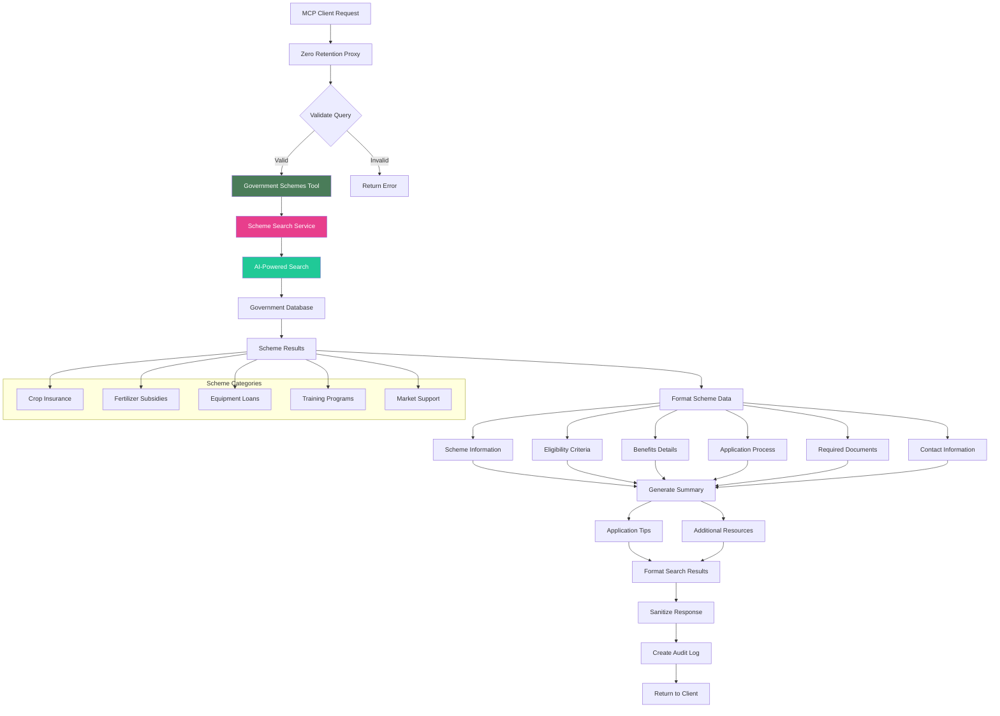

### Government Schemes Features:

1. **Query Processing**: Handles natural language scheme searches
2. **AI Search**: Uses advanced search algorithms for relevant results
3. **Structured Data**: Organizes scheme information systematically
4. **Application Guidance**: Provides step-by-step application help
5. **Resource Links**: Includes relevant government portals and contacts

## 📚 Agricultural Research Search Agent

The Agricultural Research Agent searches scientific literature and best practices.

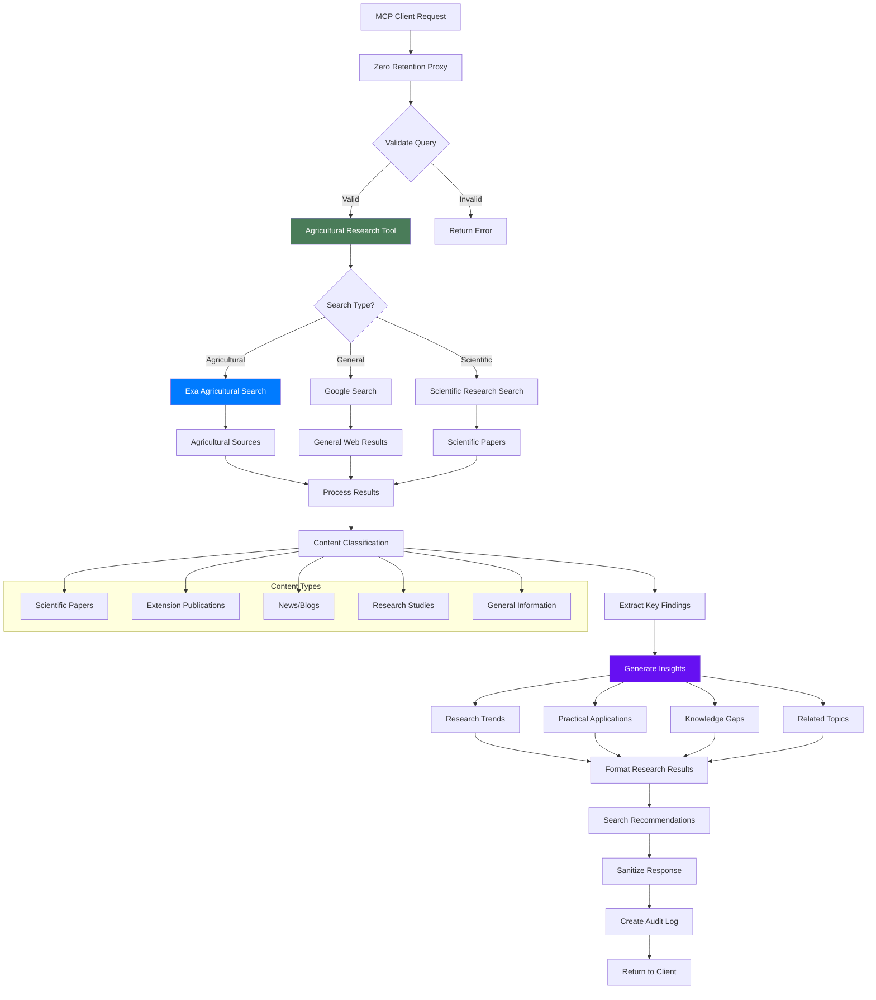

### Research Search Features:

1. **Multi-Source Search**: Integrates multiple search engines and databases
2. **Content Classification**: Categorizes results by type and relevance
3. **Insight Generation**: Extracts key findings and trends
4. **Practical Focus**: Emphasizes actionable agricultural applications
5. **Recommendation Engine**: Suggests improved search strategies

## 📅 Crop Calendar Resource Agent

The Crop Calendar Resource provides seasonal agricultural planning data.

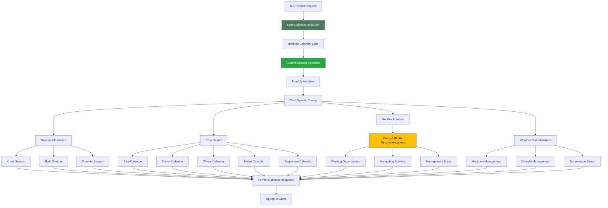

### Crop Calendar Features:

1. **Seasonal Planning**: Provides timing for Kharif, Rabi, and Summer seasons
2. **Crop-Specific Guidance**: Detailed calendars for major crops
3. **Current Context**: Highlights activities relevant to current month
4. **Weather Integration**: Considers weather patterns in recommendations
5. **Regional Focus**: Optimized for Karnataka agricultural conditions

## 🦠 Disease Database Resource Agent

The Disease Database Resource provides comprehensive crop disease information.

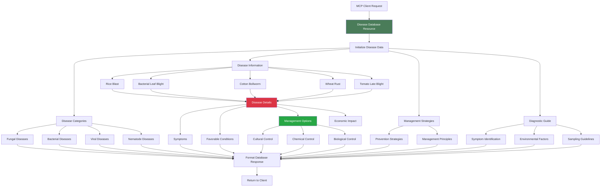

### Disease Database Features:

1. **Comprehensive Coverage**: Includes major crop diseases across categories
2. **Detailed Information**: Symptoms, causes, and management for each disease
3. **Management Options**: Cultural, chemical, and biological control methods
4. **Diagnostic Support**: Guidelines for accurate disease identification
5. **Prevention Focus**: Emphasizes preventive strategies and IPM approaches

## 🔒 Zero Retention Proxy Agent

The Zero Retention Proxy ensures complete data privacy across all agents.

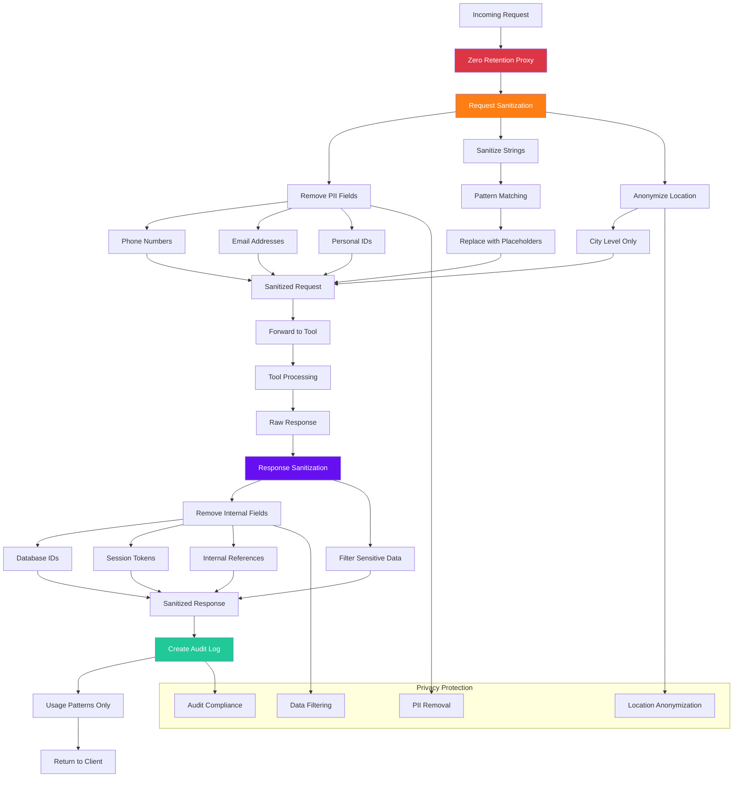

### Zero Retention Features:

1. **PII Sanitization**: Automatically removes personal information
2. **Location Privacy**: Reduces location precision to city level
3. **Response Filtering**: Strips internal system data from responses
4. **Audit Logging**: Records usage patterns without storing actual data
5. **Compliance**: Ensures GDPR and privacy regulation compliance

## 💬 Prompt Generation Agents

The Prompt Generation system creates structured agricultural guidance prompts.

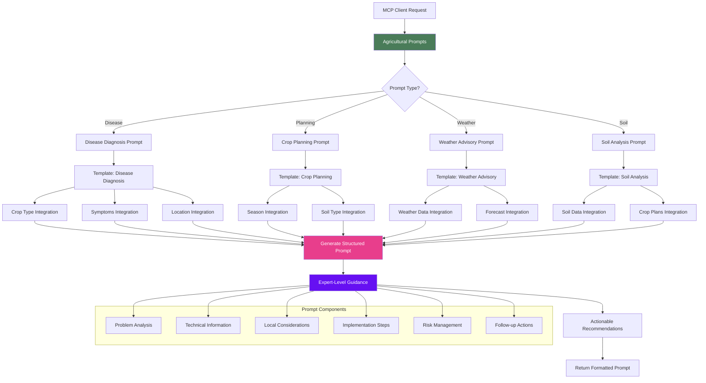

### Prompt Generation Features:

1. **Template System**: Structured templates for different agricultural scenarios
2. **Dynamic Integration**: Incorporates user-provided context and data
3. **Expert Guidance**: Provides professional-level agricultural advice
4. **Actionable Content**: Focuses on practical, implementable recommendations
5. **Comprehensive Coverage**: Addresses all aspects of agricultural decision-making

## 🔄 Agent Interaction Flow

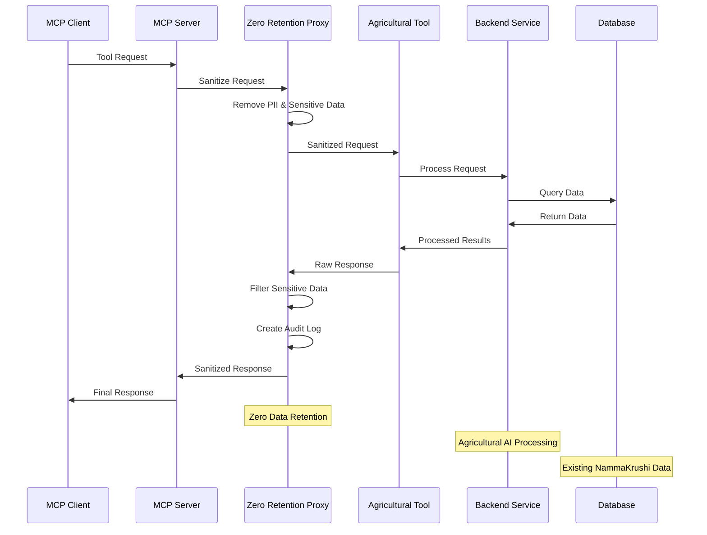

## 🎯 Agent Performance Metrics

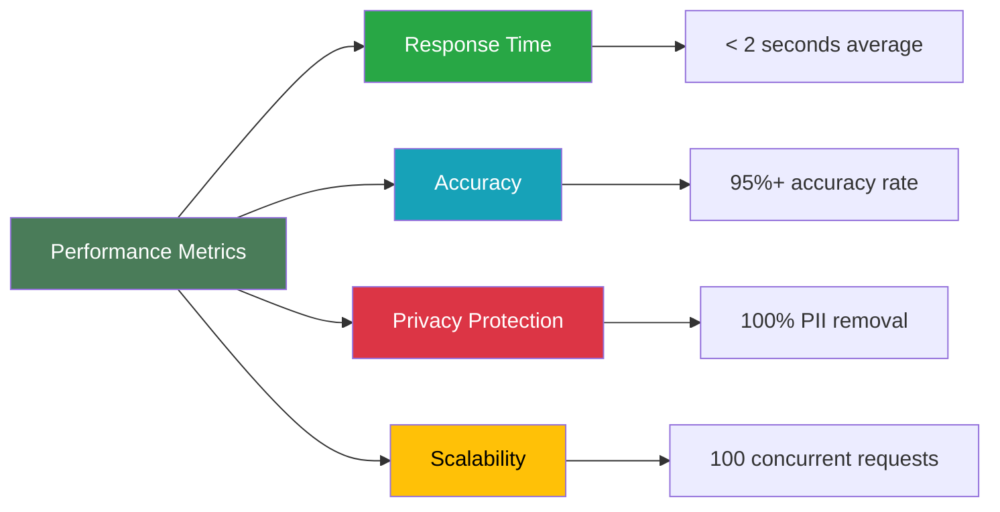

## 🚀 Deployment Architecture

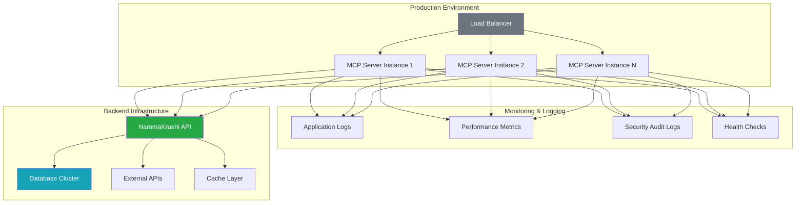

This comprehensive agent architecture ensures that NammaKrushi's agricultural expertise is accessible through any MCP-compatible AI application while maintaining the highest standards of data privacy and system performance.